# rayimage

<!-- badges: start -->

[](https://github.com/tylermorganwall/rayimage/actions)
[](https://tylermorganwall.r-universe.dev/)
[](https://tylermorganwall.r-universe.dev/rayimage)

<!-- badges: end -->

</img>

## Overview

**rayimage** is an open source R package for image manipulation and
simulated camera effects. **rayfocus** uses convolution-based techniques
to generate simulated camera bokeh, depth of field, and other camera
effects, using an image and an optional depth map. It includes functions
to perform 2D convolutions, add image overlays, generate camera vignette
effects, and add titles to images.

## Installation

``` r
# To install the latest version from Github:
# install.packages("remotes")
remotes::install_github("tylermorganwall/rayimage")
```

## Functions

- `render_bokeh()` takes two images as an input: an in-focus image, and
  a depth map for that image. These can either be in-memory
  representations of the image, or file paths to the images. The user
  can also specify various camera settings, including: focal length,
  f-stop, aperture shape (including custom aperture shapes passed by the
  user), aperture rotation, bokeh intensity, bokeh intensity limit. The
  output is either plotted to the current device, or save to a file (if
  a filename is passed to the function).

- `render_convolution()`/`render_convolution_fft()` performs a
  convolution with a user-supplied kernel (either custom, or using one
  of the built-in functions to generate a kernel:
  `generate_2d_gaussian()`, `generate_2d_exponential()`, and
  `generate_2d_disk()`). This function can be applied to either images
  represented by RGB arrays/file-names, or 2D matrices.

- `render_resized()` resizes an image or a matrix using a magnification
  factor or the dimensions of the desired object. This function
  interpolates between points using bilinear interpolation.

- `render_reorient()` reorients an image, either flipping horizontally,
  vertically, or with a transpose operation.

- `render_text_image()` generates a tightly bounded image containing
  text, with custom font support and emoji support if the `ragg` package
  is installed.

- `render_title()` adds titles to images, with an optional title bar.
  User can specify opacity, color, and font properties.

- `render_vignette()` adds a camera vignette effect, which is a slight
  darkening by the edges of an image.

- `render_image_overlay()` adds overlays to images.

- `plot_image()` plots an RGB array to the current device.

- `plot_image_grid()` plots a list of RGB arrays in a user-specified
  grid to the current device.

## Usage

The package comes with a sample image and depth map derived from
Stanford “Chinese Dragon” 3D model. The image is included in rayimage as
`dragon` and the depthmap is `dragondepth`. We plot these 3D image
arrays simply by calling `plot_image()`.

``` r
library(rayimage)
library(grid)

plot_image(dragon)
```

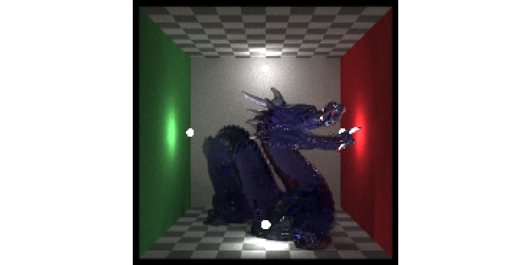<!-- -->

``` r
plot_image(dragondepth/2000)
```

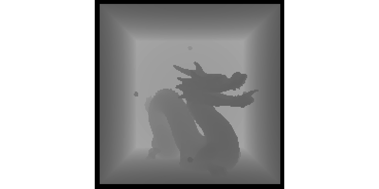<!-- -->

You can also easily plot a grid of images.

``` r
plot_image_grid(list(dragon, dragondepth/2000), 
                dim = c(2,1))
```

<!-- -->

Preview the focal plane.

``` r
render_bokeh(dragon,dragondepth,focus=930,preview_focus = TRUE)
```

    ## Focal range: 847.644-1410.17

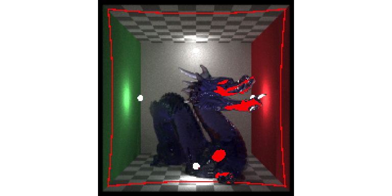<!-- -->

``` r
render_bokeh(dragon,dragondepth,focus=930,focallength=250)
```

<!-- -->

``` r
render_bokeh(dragon,dragondepth,focus=1300,preview_focus = TRUE)
```

    ## Focal range: 847.644-1410.17

<!-- -->

``` r
render_bokeh(dragon,dragondepth,focus=1300,focallength=250)
```

<!-- -->

We can also adjust the focal point, shape of the aperture, f-stop, focal
length, as well as the bokeh intensity.

``` r
image_list = list()
image_list[[1]] = render_bokeh(dragon,dragondepth,focus=1100,focallength = 400,
             bokehshape = "hex", bokehintensity = 1, preview = FALSE)
image_list[[2]] = render_bokeh(dragon,dragondepth,focus=900,focallength = 400,
             bokehshape = "hex", bokehintensity = 1, preview = FALSE)
image_list[[3]] = render_bokeh(dragon,dragondepth,focus=900,focallength = 400,
             fstop = 16, bokehshape = "hex", preview = FALSE)
image_list[[4]] = render_bokeh(dragon,dragondepth,focus=900,focallength = 300,
             bokehshape = "hex", bokehintensity = 5, preview = FALSE)
plot_image_grid(image_list, dim = c(2,2))
```

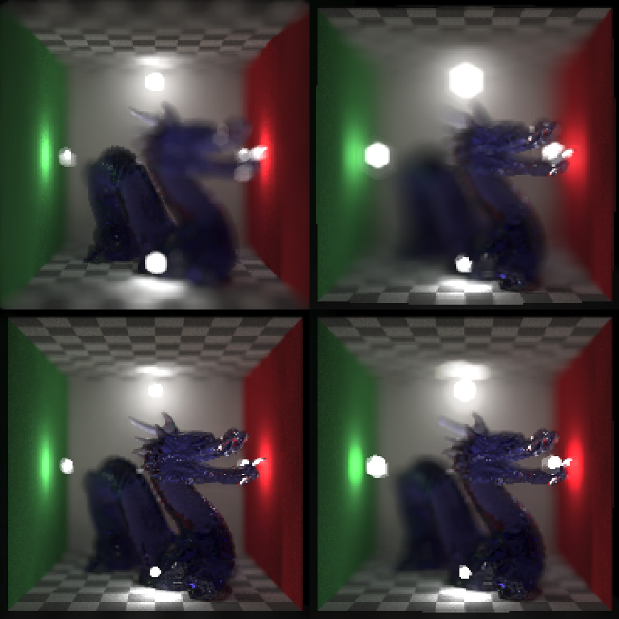<!-- -->

We can add a camera vignette effect, titles, and add overlays (not shown
here):

``` r
image1 = dragon |>
  render_title("Dragon", title_size = 20, title_bar_color = "red", 
            title_bar_alpha=0.8, title_color="white", title_offset = c(12,12))

image2 = dragon |>
  render_vignette(vignette=0.8)

plot_image_grid(list(image1,image2), dim = c(2,1))
```

<!-- -->

We can generate images with custom fonts and emojis:

``` r
#Use a custom font.
render_text_image("AVATAR", font = "Papyrus", size=100,
                  color = "#aaddff", 
                  background_color = "black",
                  preview = TRUE)
```

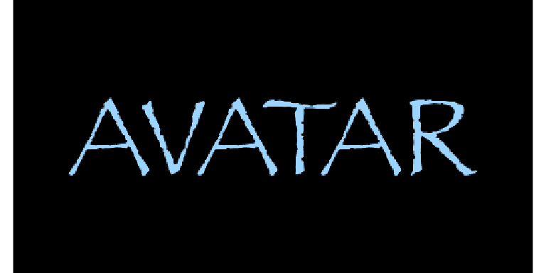<!-- -->

``` r
#Plot an emoji with the agg device and increase resolution.
render_text_image("😀🚀", size = 500,
                   background_alpha = 0,
                   preview = TRUE)
```

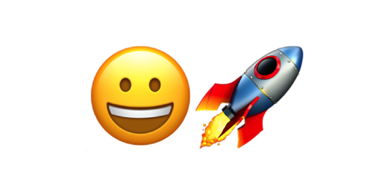<!-- -->

We can also resize images and matrices with `render_resize()`. We can do
this before adding text to make the resulting text smoother.

``` r
#Double the input size to make the resulting text smoother.
image3 = dragon |>
  render_resized(mag = 2) |>
  render_title("Dragon", title_size = 20, title_bar_color = "red", 
            title_bar_alpha=0.8, title_color="white", title_offset = c(12,12)) 

#Specify resulting dimensions directly.
image4 = dragon |>
  render_resized(dim = c(600,300)) |>
  render_title("Dragon", title_size = 20, title_bar_color = "red", 
            title_bar_alpha=0.8, title_color="white", title_offset = c(12,12)) 

plot_image_grid(list(image3,image4), dim = c(2,1))
```

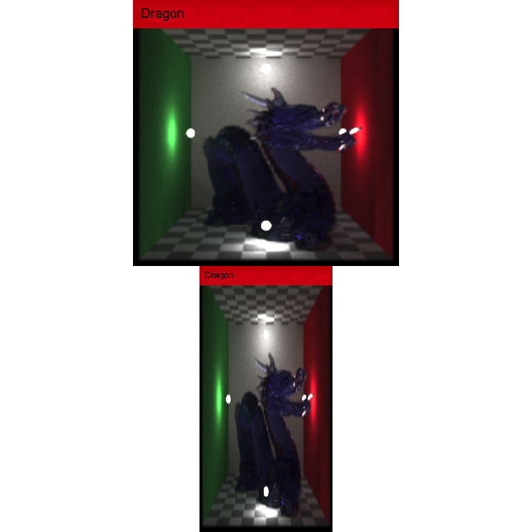<!-- -->

Reorienting images and matrices can be done with `render_reorient()`:

``` r
render_reorient(dragon, preview = TRUE)
```

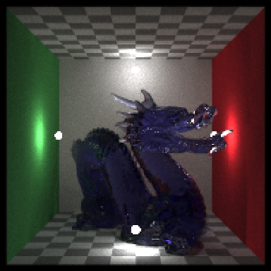<!-- -->

``` r
render_reorient(dragon, flipx = TRUE, preview = TRUE)
```

<!-- -->

``` r
render_reorient(dragon, flipy = TRUE, preview = TRUE)
```

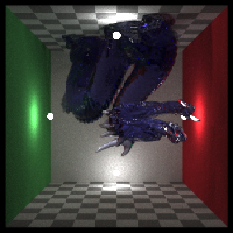<!-- -->

``` r
render_reorient(dragon, transpose = TRUE, preview = TRUE)
```

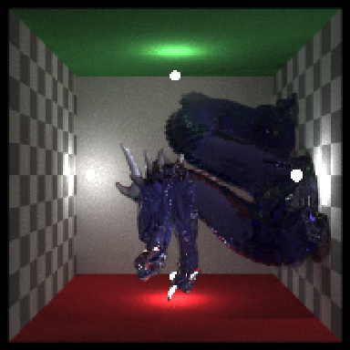<!-- -->

We can also use the `render_convolution()` directly to perform a
convolution with a user-defined (or built-in) kernel.

``` r
#Default gaussian kernel
plot_image_grid(list(render_convolution(dragon, kernel = "gaussian"),
                     generate_2d_gaussian(1,1,11,3, rescale_unity = TRUE)),
                dim = c(2,1))
```

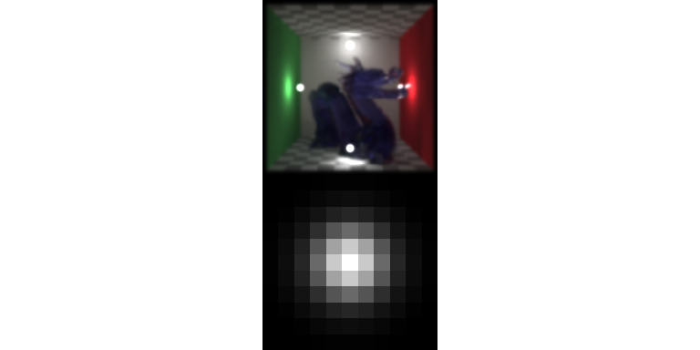<!-- -->

``` r
#Custom gaussian kernel
plot_image_grid(list(render_convolution(dragon, kernel = generate_2d_gaussian(10,1,31,21)),
                     generate_2d_gaussian(10,1,31,21, rescale_unity = TRUE)),
           dim = c(2,1))
```

<!-- -->

``` r
#Custom exponential kernel
plot_image_grid(list(render_convolution(dragon, kernel = generate_2d_exponential(3,31,21)),
                    generate_2d_exponential(3,31,21, rescale_unity = TRUE)),
           dim = c(2,1))
```

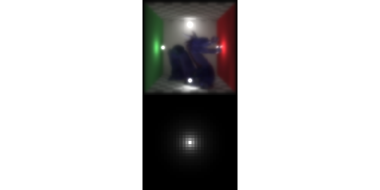<!-- -->

``` r
#Custom disk kernel
plot_image_grid(list(render_convolution(dragon, kernel = generate_2d_disk(31)),
                     generate_2d_disk(31, rescale_unity = TRUE)),
           dim = c(2,1))
```

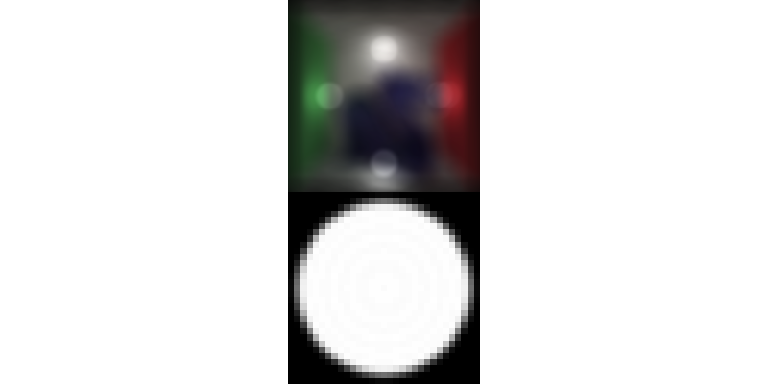<!-- -->

We can also use this to perform generate discrete 2D convolutions with
matrices:

``` r
par(mfrow = c(1,2))

volcano |> image()
volcano |> 
  render_convolution(kernel=generate_2d_gaussian(sd=1,dim=31)) |> 
  image()
```

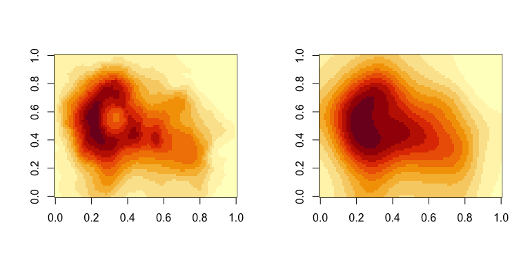<!-- -->

And here we use a user-defined kernel, in the shape of a cross.

``` r
custom1 = matrix(0, nrow=11,ncol=11)
custom1[6,] = 1
custom1[,6] = 1
custom2 = diag(10) + (diag(10)[,10:1])

plot_image_grid(list(custom1,custom2,
                     render_convolution(dragon, kernel = custom1),
                     render_convolution(dragon, kernel = custom2)),
                dim = c(2,2))
```

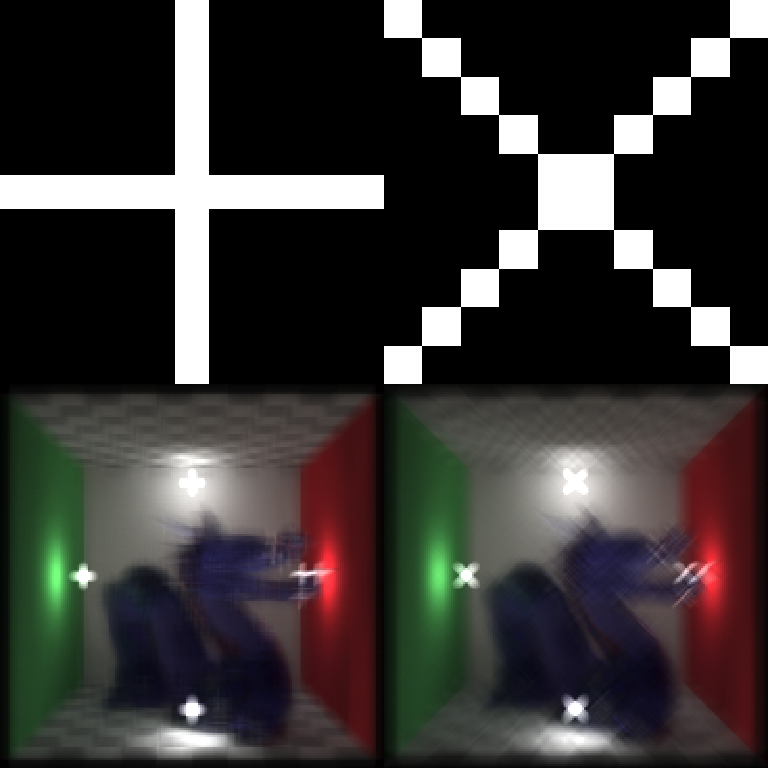<!-- -->
